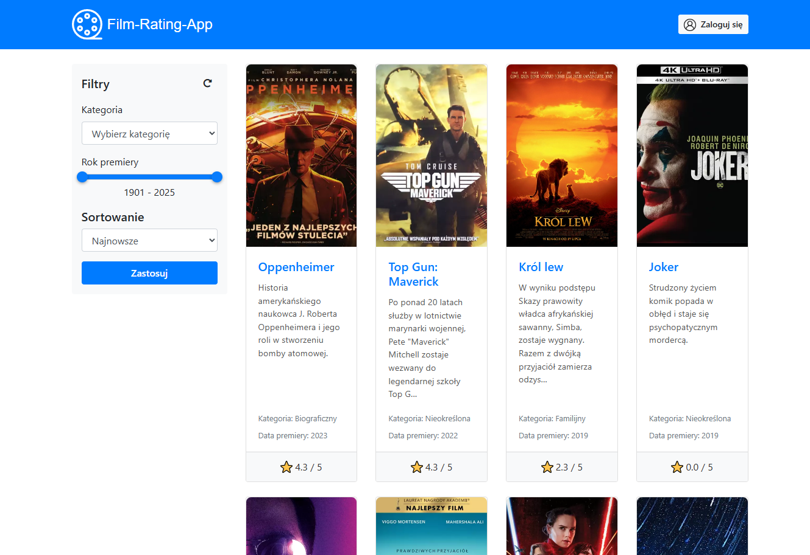
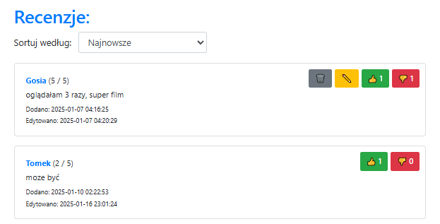
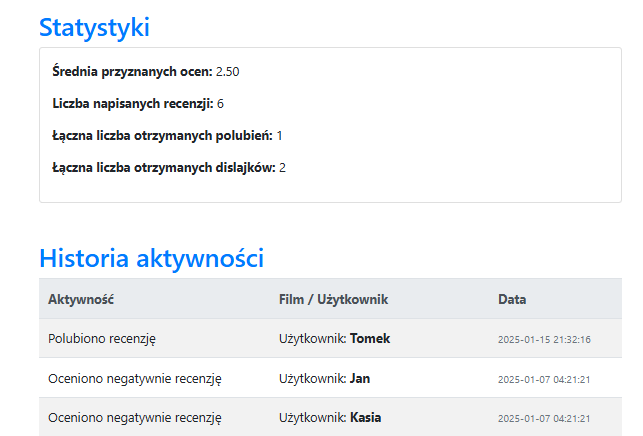
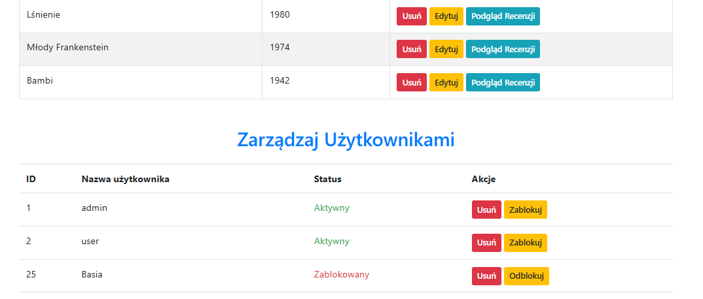

# film-rating-app

Simple PHP web application for browsing films, rating them, writing reviews, and managing content through an admin panel.

Built with PHP, MySQL, Bootstrap 4, JavaScript, and AJAX (Fetch API), with additional UI libraries such as noUiSlider and Font Awesome.

---

## Preview

### Browse films

### Film reviews

### User profile

### Admin panel

---

## Features

* film list with pagination
* filtering by category and release year
* sorting by release date and rating
* user registration and login
* adding, editing, and deleting reviews
* like / dislike voting on reviews
* user profile with activity history and statistics
* admin panel for managing films, categories, and users
* user-friendly URLs
* client-side and server-side form validation

---

Created as a learning project.
